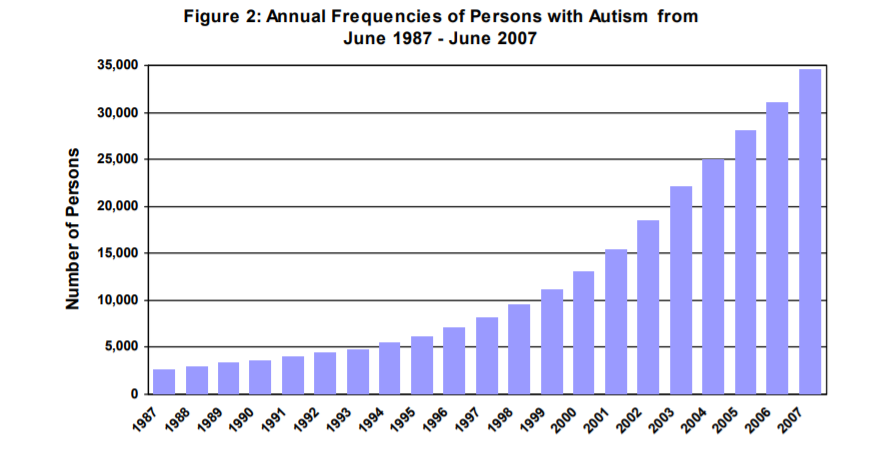
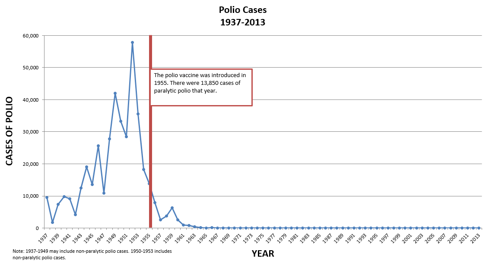
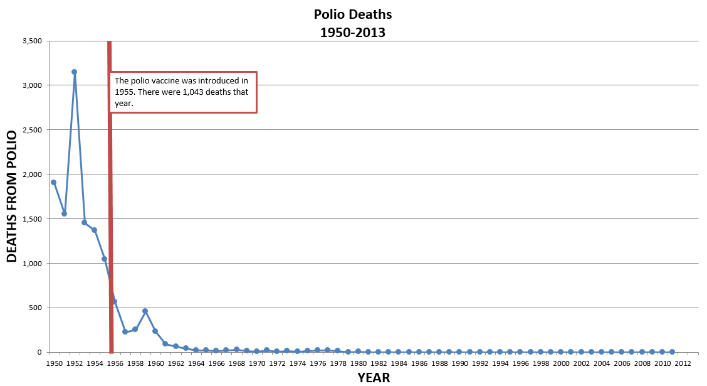

# Jerfenson Cerda Mejia
# Date: 10/12/18

#Question 6.

Since I was not able to find actual data to use and create a plot for it. I
was able to find a study from [dds](https://www.dds.ca.gov/Autism/docs/AutismReport_2007.pdf)
that shows the number of cases of autism from 1987 to 2007.

# Question 7.

I used data exploration to determine if diseases such as Polio have enough data
to see the effects of the vaccines created to this disease. Polio is an incurable
and potential deadly infectious disease cause by a virus that spreads from
person to person which invades the brain and spinal cord and causing paralysis.
It wasn't until 1905 that it was discover that Polio was a contagious disease.
In 1910, it was introduce to research vaccines against Polio, but it wasn't until
1955 that  an actual vaccine was created by Jonas Salk. In 1994, Polio was
declared eradicated in Americas by the Pan American Health Organization. There
was an improve version of the vaccine in 1997 because the first version had an
increase risk of infecting children with the virus in the first dose. Finally
in 2000 the transitions to all IPV vaccines schedule was complete.

In the image below we can see that between 1937 and 1953 there was a major increase in the number of Polio cases in the United States. After 1955  when the vaccine was created the  numbers of Polio cases significantly drop.

We can see the same pattern in the image below.
the number of deaths increased between 1950 and 1953. After the vaccine those the number of deaths decreased.

## Sources
* [Polio Cases, Deaths, and Vaccination Rates](https://vaccines.procon.org/view.additional-resource.php?resourceID=005964)

# Question 8.

The Research Paper by Dr. Andrew Wakefield linking combined vaccine to the cause
of Autism damage the public medicine damaged the public medicine image and it fueled
an already going controversy in the public. The research paper damages the
public medicine because it leads to a belief that vaccines are unsafe. It discredited
all the research that has been done that concludes that there is no link between
vaccine and Autism. The public option believes more than ever that their children
mental issues are caused by vaccines. After Dr. Andrew Wakefield study
vaccination rates have dropped significantly in Britain and the number of measles
cases soared. His study lit the fire again and cause many parents and groups to
believe that vaccines are linked to mental problems. Many parents until this day thinks
is not a good idea to vaccinate their children because they fear it will cause
a mental disorder.

The role of academic research groups and organizations should be to review, analyze,
and validate any research before publishing it to the public. Any study should
be review by many organizations or groups in order to ensure that the data and
information are valid. They can implement a system where any study has to go over
review period where they can conduct many analyzes where they ensure that data
is right, from where the data came from and researchers should be able to exploration
step by step how they did their study

The retracting of the paper was not enough to fix the damage done to public medicine.
There was already controversy about vaccine link to Autism the paper only made it
worse and more people believe that controversy. I think one possible way is to do more  
studies but at the same time if those studies show that there is no link between vaccine
and autism like others have. Is up to the public too if they believe in it or not.
I think that once a person has strong beliefs about something, no matter how many
times you disprove it, they will still believe in it.  

# Question 9.

Outbreaks of serious ailments in diverse communities all over the world is a
serious ongoing problem, especially in developing countries. Thanks to the
the effort of many UN groups and countries, many of these outbreaks are being
contained and people are getting vaccinated to prevent them from getting infected.
Below are two examples of how vaccines are helping developing countries fight
these outbreaks.

The Ebola outbreaks have been a serious health issue in many developing countries
in Africa. The Democratic Republic of the Congo and the Republic of Guinea both
have experienced a high number of Ebola outbreaks in their country. But Thanks
to their effort and National Institute of Biomedical Research they a movement around
both nations to vaccinate those who have been infected. During the trials, They
found the vaccine was highly effective against Ebola and has proven sufficiently safe and effective.

Another beneficial vaccine that is very important especially for girls is HPV vaccines.
More than 80 countries and millions of girls are now able to get vaccinated to
prevent human papillomavirus (HPV), reducing their risk of developing cervical cancer.
HPV is a disease that affects young women in their productive years. It causes
more years of life lost than any other cancer and at least one woman every two
minutes will lose their lives to the disease. Is important for young girls to
get this vaccine and it can save their lives and reduce the chances of getting HPV

## Sources
* [Ebola vaccine provides protection](http://www.who.int/news-room/feature-stories/detail/ebola-vaccine-provides-protection-and-hope-for-high-risk-communities-in-the-democratic-republic-of-the-congo)

* [Protecting adolescents with HPV vaccine](http://www.who.int/news-room/feature-stories/detail/protecting-adolescents-with-hpv-vaccine)

Question 10.

During las week lab talk it was interesting learning about two different perspective
of data analytics (Medical and Economic analyze). When it comes to Medical data
is sort of secretive thing since there is a chance your study can be publish
and you can become highly recognize in the medical public. Once the data is publish
it can become easier to obtain and study the data. In the economic side is
different, that data is widely available and researchers are not that secretive
about the research they are doing. Another interesting fact I learn is the way
they collect data. Is more of a sampling a group of people than actually collecting
data over a period of time from one person at a time. Sampling seems more
reasonable to do and less time consuming. The economic part of the talk
I resonated more with. I would like to do some research on economic issues
in developing countries and how they can improve their economy.
